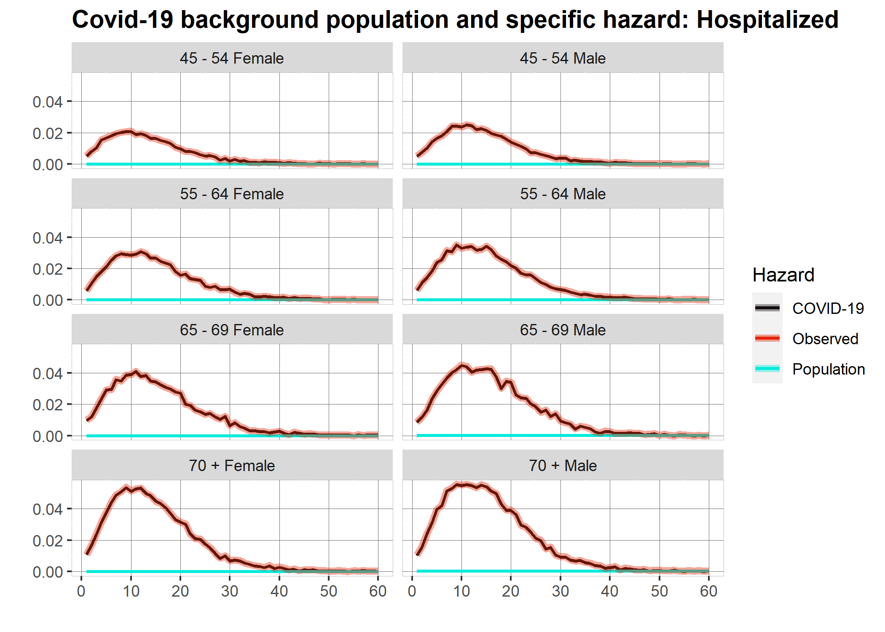
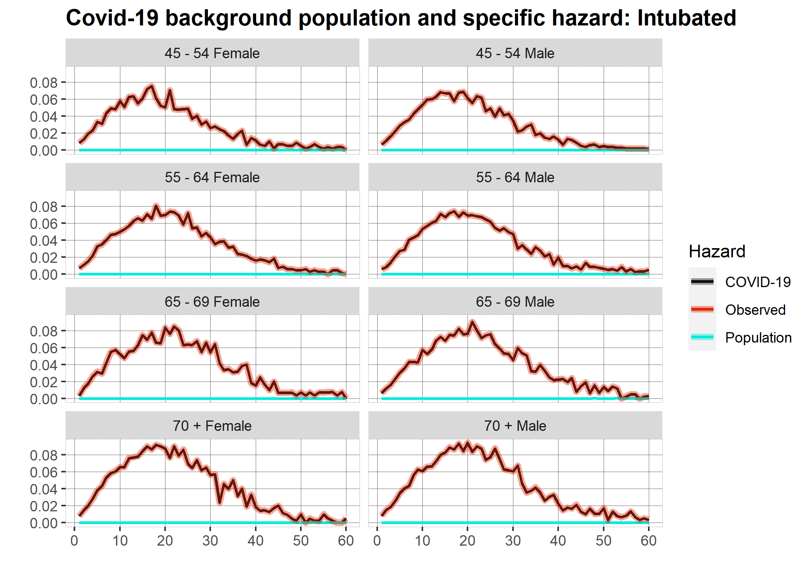

```{r setup, include=FALSE}
knitr::opts_chunk$set(echo = F)
library(dplyr)
library(ggplot2)
library(utils)
library(scales)
library(dampack)
library(chron)
library(tibble)
library(knitr)
library(pander)
library(kableExtra)
library(CEAutil)
library(tidyr)
library(dampack)
library(readxl)
library(readr)
library(lme4)
```


## Avances y resultados

Este reporte muestra los avances en mi trabajo de investigación: "COVID-19 Mortality Excess and Cost-Effective Analysis of Different Treatments". Lo que se presenta  son visualizaciones de los resultados obtenidos hasta el momento, ya que el procedimiento convenido con mi asesor, el Dr. Fernando Alarid-Escudero,es que primero se trabajen los resultados y las visualizaciones y posteriormente redactar el trabajo de investigación.


## Riesgos Relativos

Estos son los resultados de riesgos relativos. Las curvas muestran los tres tipos de hazards: Riesgo específico de COVID-19, riesgo general para cada grupo de edad y sexo, y riesgo total que engloba a los dos anteriores.


### Hospitalizados
```{r, out.width = "77%", fig.align = 'center'}

```

### Intubados

```{r, out.width = "77%", fig.align = 'center'}

```

